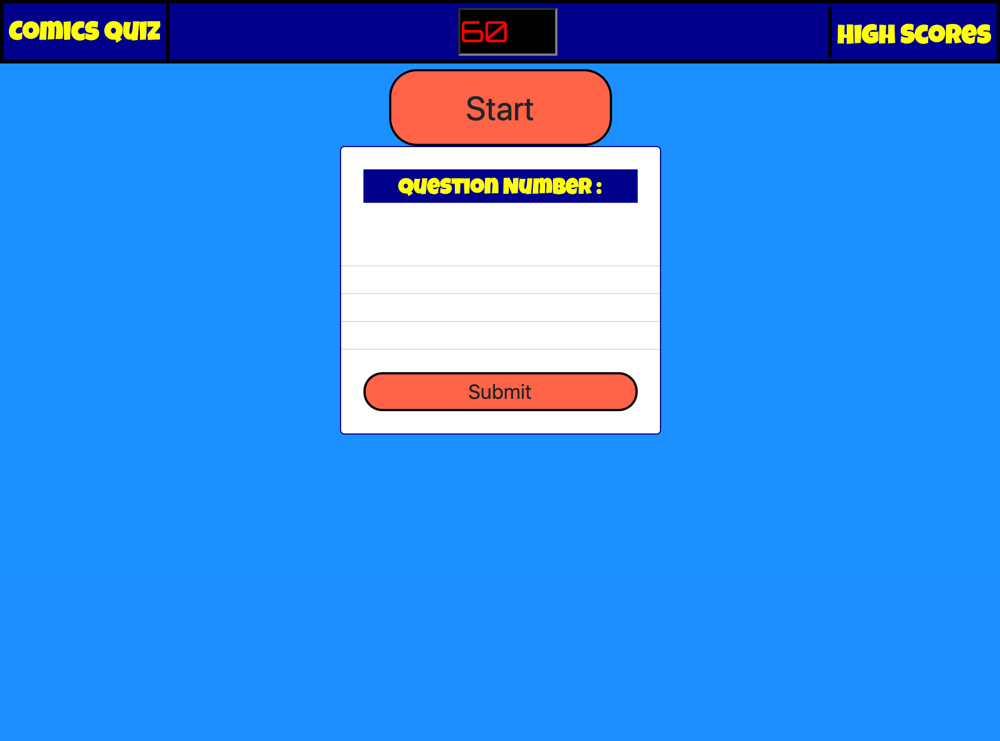

https://jbdunks.github.io/quiz/

The goal was to create a multiple choice quiz that also had a timer. Correct answers are to add time to the clock and wrong answers subtract time. After the user runs through the questions they are presented with a promp to enter their name into the high scores. The high scores are to be saved on local storage.

